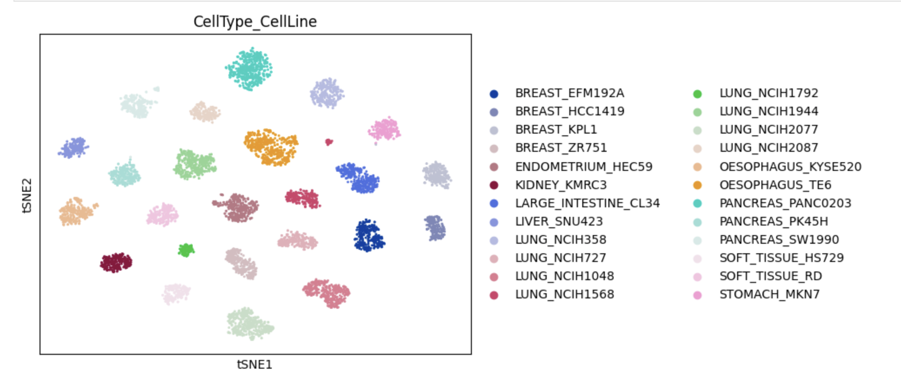
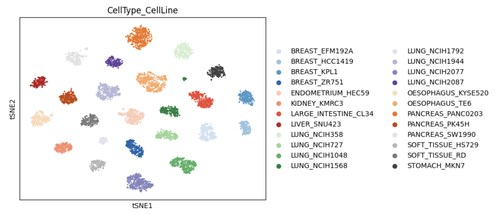
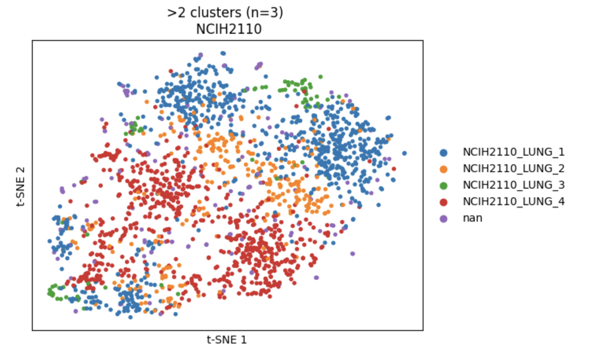
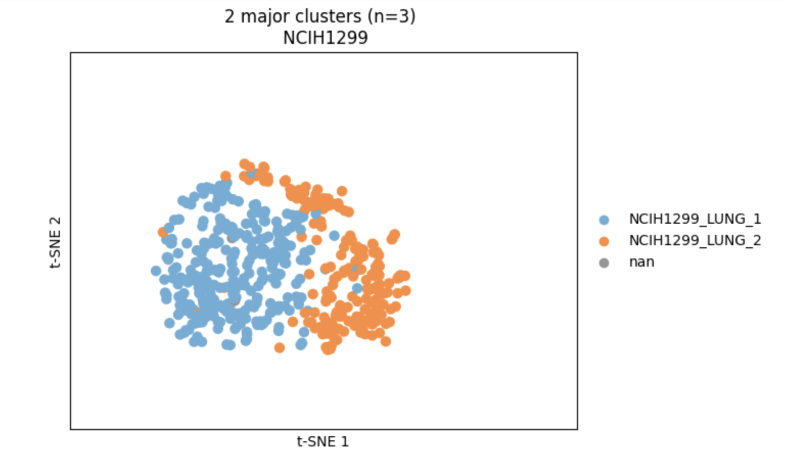

# F1L-scRNA-seq
This is part of the Figure 1 Lab (F1L) internship emulator where we dive into the Kinker paper (https://www.ncbi.nlm.nih.gov/pmc/articles/PMC8135089/) to recreate the first figure of the paper.  Through this process, I will learn the fundamentals of single-cell RNA sequencing (scRNA-seq), its use in cancer research and drug development, and how to analyze and interpret scRNA-seq data.  
&nbsp;

## Table of Contents
- [Key Scientific Question](#the-key-scientific-question)
- [Week 1 Memo](#week-1-memo)
- [Week 2 Memo](#week-2-memo)
- [Week 3 Results](#week-3-results)
- [References](#references)
  
&nbsp;

## The Key Scientific Question

**KSQ**: Using available scRNA-seq data from cancer cell lines, how would you explore the use of the following FDA-approved antibody therapies in additional cancers?

- Trastuzumab:  Targets HER2 and is used in the treatment of HER2-positive breast and gastric cancers.
- Bevacizumab:  Targets VEGF and is used for a variety of cancers, including colorectal, lung, glioblastoma, breast, liver, and kidney cancer.
&nbsp;


## Week 1 Memo

### Cancer Cell Lines
#### What are cancer cell lines?
Cancer cell lines are populations of cancer cells that have been cultured in the lab and can grow indefinitely. They are derived from tumor tissue samples from various cancer types and cultured in a laboratory under controlled conditions to allow these cancer cells to continue growing and dividing.  Since tumor cells do not go through the same cellular aging and death process as normal cells (Hayflick limit), the tumor cells are immortalized in these cell line, preserving their genetic and phenotypic traits.  Thus, these cells lines are used extensively in research.  

Some of the applications in research are as follows:
- Basic Research: Understanding cancer biology, including the genetic and molecular mechanisms of cancer development and progression.
- Drug Discovery and Testing: Screening for new anti-cancer drugs and evaluating their efficacy and toxicity.
- Genetic Studies: Manipulating genes to study their roles in cancer and identifying potential targets for therapy.
- Biomarker Discovery: Identifying and validating biomarkers for cancer diagnosis, prognosis, and treatment response.
- Mechanistic Studies: Investigating cellular processes and signaling pathways involved in cancer.
&nbsp;  
#### Why do we use cancer cell lines?
Cancer cell lines are widely used in research because of the consistency and reproducibility of source material.  Once established, cancer cells lines can be propagated indefinitely while preserving their genetic and phenotypic information.  This allows researchers to conduct experiments repeatedly using the same source and under the same conditions.  In addition, cancer cell lines allow researchers to genetically modify the cells and study the effects of specific genes for cancer development and progressions.  Techniques such as CRISPR-Cas9, RNA interference, and overexpression systems are commonly used.  Cell lines are also useful in screening potential anti-cancer drugs for efficacy and toxicity in a high-throughput fashion to identify promising therapeutic candidates.  
&nbsp;  


### scRNA-seq 
#### What is single-cell RNA sequencing (scRNA-seq)?
scRNA-seq is a genomic research technique that detects and quantitatively analyzes the mRNA  for gene expression profiles in single cells within a biological sample such as tissue or tumor.
Unlike traditional bulk RNA-seq techniques where it measures the average gene expression profiles of a many cells in a sample, scRNA-seq allows researchers to gain insights into the heterogeneity of gene expression within a cell population.   This allows researchers to understand the diversity and complexity of cellular functions and states in various biological contexts.

Advantages of scRNA-seq include high resolution which affords insights at the single-cell level and can reveal cellular heterogeneity, unbiased which allows for discovery of rare cell types and new states without prior knowledge, and can capture wide range of dynamic range of gene expression levels.

Disadvantages of scRNA-seq include high technical noise, meaning that there are variability in the technical process; the high complexity of data requires sophisticated computational tools and expertise to analyze and interpret the data; and higher cost due to the complexity of the technique.  
&nbsp;  

#### Why do we use scRNA-seq data in cancer drug development?
Given the above advantages, scRNA-seq allows deeper understanding of tumor heterogeneity, can identifying cancer stem cells, and aid investigating of mechanisms of resistance to therapies.

- Understanding tumor heterogeneity:
    - In addition to ability to identify cellular diversity, scRNA-seq can also identify tumor cells that have distinct mutations.  Researchers can use scRNA-seq to follow the evolution of these identified tumor cells and help understand how tumors develop resistance to therapies.
- Identify therapeutic targets:
    - By analyzing gene expression profiles at the single-cell level, researchers can identify specific biomarkers or molecular targets that are expressed in particular subpopulations of cancer cells, which may be missed in bulk RNA-seq analyses.
    - scRNA-seq data can also reveal activation status of signaling pathways in individual cell.  This helps researchers identify key signaling pathways that are driving cancer progression and identify points of intervention for targeted therapies.
- Drug screening and validation:
    - scRNA-seq can be used to screen the effects of drugs on different cell populations within a tumor, helping to identify compounds that target specific cancer cell subtypes or resistant cells.
    - Also, by understanding the complex interactions between different cell types and signaling pathways, scRNA-seq can help in designing combination therapies that are more effective in targeting multiple aspects of tumor biology.  
&nbsp;  

#### scRNA-seq workflow: 
1. Isolate of viable single cells from the tissue of interest using some of the following methods:  micro-dissection, flow cytometric cell-sorting, microfluidic platforms, droplet-based methods (Haque et al, 2017).
2. Lyse single-cells to preserve cellular mRNA.
3. mRNA capture using poly(T) primers that bind to poly(A) tails of mRNA.
4. Reverse-transcribe poly(T)-primed mRNA into cDNA.
5. Amplify cDNA by PCR or in vitro transcription.
6. Generate cDNA sequencing libraries for respective NGS technologies (add indexes or barcodes to identify each library).
7. Pool cDNA libraries and sequence on NGS.
8. Use bespoke bioinformatic tools to analyze scRNA-seq data.
    1. QC and filter out poor quality data such as from low quality cells, 2+ cell data mistaken as single cell.
    2. Reduce multi-dimensional data to smaller dimensions for visualization and interpretation by using methods such as Principal Component Analysis (PCA), t-distributed stochastic neighbour embedding (t-SNE), and Gaussian process latent variable modelling (GPLVM).
    3. Clustering into subpopulations by functional similarity or developmental relationships  
&nbsp;  


### Cancer Drugs
#### Trastuzumab 
It targets HER2 and is used in the treatment of HER2-positive breast and gastric cancers.

**What is trastuzumab?**
- Trastuzumab (Herceptin) is a monoclonal antibody that targets the extracellular domain of HER2 protein.  
- It binds to the extracellular domain of HER2, suppressing its intracellular signaling pathways.  
- What is the mechanism for trastuzumab treatment of HER2+ BC?  
    - Inhibition of HER2 Signaling:
        - Prevention of Dimerization:  
            - Tratsuzumab binds to the extracellular domain of HER2, which can interfere with the receptor's ability to dimerize with other HER family members.  This inhibition of heterodimerization is crucial because heterodimers (especially HER2/HER3) are highly potent activators of downstream signaling pathways that promote cell proliferation and survival.
            - Some studies have shown that tratsuzumab induces HER2 homodimerization in HER2+ BC cell lines.  This suggests that by inducing homodimerization, tratsuzumab reduces HER2 heterodimerizations, which inhibits downstream signaling.
				
    - Reduction of HER2 levels on the Cell Surface:
        - Receptor Downregulation:  Some studies have shown that trastuzumab induces the internalization and degradation of HER2 receptors.  By promoting endocytosis and subsequent lysosomal degradation, trastuzumab reduces the number of HER2 receptors available on the cell surface.  This reduces the potential for both homo- and heterodimer formation.
		    
    - Antibody-Dependent Cellular Cytotoxicity (ADCC): 
        - Immune System Activation:  Trastuzumab can recruit immune cells, such as natural killer (NK) cells, to target and kill HER2-overexpressing cancer cells through ADCC.  
				
- Trastuzumab reduces the overall amount of HER2 on the cell surface, thereby limiting the ability of HER2 to form both homodimers and heterodimers.  This reduction in dimerization potential leads to decreased activation of signaling pathways such as PI3K/AKT and MAPK pathways, that drive cell proliferation and survival in HER2+ cancers.  
&nbsp;  

**What is HER2?** 
- Human Epidermal Growth Factor 2 (HER2) is a protein encoded by the ERBB2 gene located at the human chr17 q21 region.  It is a member of the ErbB receptor tyrosine kinases, including EGFR, HER3 and HER4.
    - By binding to growth factors on the cell surface, it can activate signaling pathways promoting cell growth, division and repair.
    - Amplification of the ErbB gene can lead to over-expression of the HER2 protein, which can cause uncontrolled cell growth and division, subsequently leading to cancer, such as HER2+ breast cancer.  This subtype of breast cancer is more aggressive and can spread more quickly than HER2- cancers.
    - HER2 receptors structure contains 3 parts:
        - Ligand-Binding Domain:  Extracellular domain containing 4 subdomains on the cell surface that is responsible for binding to ligands for activation. HER2 does not have a known natural ligand, thus it is thought to be activated by dimerization with other receptors in the HER family (HER1, HER3, HER4).
		    - Transmembrane Domain:  Transmembrane domain that connects the extracellular and the cytoplasmic domains.  This domain anchors the HER2 protein in the cell membrane.  
			      - Intracellular Domain:  The C-terminal cytoplasmic domain that contains tyrosine kinase and regulatory subdomains.
				    - Tyrosine Kinase Domain:
				        - This domain has enzymatic activity that is activated upon receptor dimerization and phosphorylation.  The tyrosine kinase domain transfers phosphate groups from ATP to specific tyrosine residues on the receptor itself and on downstream signaling proteins.  This phosphorylation initiates a cascade of signaling pathways involved in cell growth, differentiation, and survival.
				    - Regulatory Regions:
					      - The intracellular part of HER2 includes various regulatory regions that control its activity and interactions with other cellular proteins.
		- These 3 domains work together to transmit signals from the extracellular environment to the cell's interior, influencing various cellular processes.   The overexpression or amplification of the HER2 gene, leading to an increased amount of HER2 protein on the cell surface, can result in the continuous activation of these signaling pathways, contributing to the development and progression of certain cancers, particularly breast cancer.  
&nbsp;  			
	
#### Bevacizumab
Targets VEGF and is used for a variety of cancers, including colorectal, lung, glioblastoma, breast, liver, and kidney cancer 

**What is bevacizumab?** 

https://www.cancer.gov/about-cancer/treatment/drugs/bevacizumab
- It is a type of targeted therapy called an angiogenesis inhibitor.  It works by blocking the VEGF protein to prevent the growth of new blood vessels that feed tumors.


Fig 1:  Graphics from Labiotech showing how VEGF promotes tumor growth by forming new blood vessels and how Bevacizumab targets VEGF protein to inhibit angiogenesis (Bancroft, 2022)


Fig 2:  Graphic showing interactions between VEGF and VEGFR-2 and how Avastin interacts with VEGF-A to prevent angiogenesis  (Bancroft, 2022).


Bevacizumab (Avastin by Roche) is a monoclonal anti-vascular endothelial growth factor antibody that targets and inhibits the VEGF protein.  It is used as a cancer treatment to reduce the formation of new blood vessels leading to tumor cells growth.  &nbsp;  

**angiogenesis:**  The process of formation of new blood vessels from existing ones.  
- Normal angiogenesis is crucial in growth and development of vascular system in embryos and the development of organs and tissues.  It is also crucial in repairing damaged tissues such as in wound healing.  It is also involved in the development of blood vessels during menstrual cycles and placental development during pregnancies.
- Abnormal angiogenesis can result in cancer where new blood vessels help tumor cells to grow and proliferate.   Also, abnormal blood vessel formations in the retina can lead to age-related macular degeneration and diabetic retinopathy.  
&nbsp;  

**What is VEGF?** 
**VEGF-A:** This is a primary growth factor involved in angiogenesis. It binds to receptors on the surface of endothelial cells, which are the cells lining blood vessels.  

**VEGFR-2:** This is one of the main receptors through which VEGF-A exerts its effects. It is predominantly expressed on endothelial cells and plays a crucial role in mediating the angiogenic signals.  

When VEGF-A binds to VEGFR-2 on the surface of endothelial cells, it triggers several intracellular signaling pathways.  
- PI3K/Akt Pathway: This pathway promotes cell survival and proliferation, contributing to the growth of new blood vessels.
- MAPK/ERK Pathway: This pathway is involved in cell growth, differentiation, and migration, which are essential for the formation of new blood vessels.
&nbsp;  

**How does bevacizumab work?**

Bevacizumab works by binding to the VEGF-A protein.  A key driver for angiogenesis is the interaction between Vascular Endothelial Growth Factor Receptor 2 (VEGFR-2) and Vascular Endothelial Growth Factor A (VEGF-A).  

When these signaling pathways like PI3k/Akt and MAPK/ERK are activated, endothelial cells divide and proliferate, then migrate to area of signal and  form new blood vessel sprouts.  They then integrate into the existing blood vessel network and become new vessels.  

By binding to VEGF-A protein, bevacizumab prohibits VEGF-A from interacting with its receptors on the endothelial cells, hence reducing angiogenesis.  Studies have also shown that bevacizumab can also reduce size of existing microvessels and reduce tumor size over time (Mukherji, S.K., 2010).   
&nbsp;  

## Week 2 Memo
This week's objective is to read through [Kinker _et el_ paper](https://www.ncbi.nlm.nih.gov/pmc/articles/PMC8135089/) (DOI: 10.1038/s41588-020-00726-6) and understand the fundamentals of this paper's study. Then follow some of the suggested resources to familiarize ourself with analyzing scRNA-seq data.
- [Single-cell best practices](https://www.sc-best-practices.org/preamble.html)
- [Luecken and Theis's paper from 2019](https://doi.org/10.15252/msb.20188746)
- Mark Sanborn showing how he analyzes scRNA-seq data: [Part 1](https://youtu.be/cmOlCTGX4Ik?si=GD-OnvawBIxWNIwH) and [Part 2](https://www.youtube.com/watch?v=FqG_O12oWR4)

### Summary
In this paper, the authors addressed the question whether the heterogeneity observed in cancer cell lines reflect those observed in malignant tumor cells from patients. Using scRNA-seq technique, the authors profiled multiplexed pools of ~200 cancer cell lines from 22 cancer types. They were able to identify several recurrent heterogeneous expression programs within several cancer cell lines that are associated with biological processes like cell cycle, senescence, stress and interferon responses, epithelial-mesenchymal transitions and protein metabolism. These programs were also recently identified as showing heterogeneous expression in human tumors.  

The authors then dived deeper into studying the subpopulations of senescence-related cells from selected cell lines as models. This study revealed an epithelial senescence-associated (EpiSen) program in subpopulations where low levels of EpiSen correlated with cell proliferation and high EpiSen correlated with lower proliferation and enriched for G0/G1 phases.  These indicate that EpiSen program is dynamically regulated between proliferation and cellular transitions.  In addition, the authors also found drug sensitivity differences between EpiSen-Low and EpiSen-High subpopulations.  EpiSen-low cells were shown to have high sensitivity to inhibitors of cell cycle regulators which matches the observation of increased proliferation.  EpiSen-high cells were shown to have high sensitivity to inhibitors like EGFR, AKT, P13k, IFG1R, DNA-PK where some of these inhibitors target the DNA repair machinery.  This is also consistent with the observation that EpiSen-high cells correlated more with cellular transitions and not in proliferation.  

Intrigued by the sensitivity responses in EpiSen programs, the authors looked into clinical responses to Cetuximab, an EGFR inhibitor used for treatment of HNSCC (head and neck squamous cell carcinoma).  Stratifying the responses by long progression-free survival (PFS) after Cetuximab treatment, they found correlation between PFS duration and EpiSen scores.  Patients with long PFS show high EpiSen scores while those with short PFS show lower PFS scores.  These observations suggest that EpiSen scores may be used as a predictor in clinical responses to treatments.  
&nbsp;

#### Some questions posed by Dean Lee to help us understand the paper
- How did the authors handle the potential caveat of co-culturing cell lines before profiling by scRNA-seq? Why do you think that caveat was or was not adequately addressed?

One caveat when co-culturing cell lines is that the different cell lines may interact in ways that alter their behavior, potentially leading to misleading results. For example, one cell line might produce factors that influence the growth or behavior of another, masking the true effects of a treatment or condition.

The caveat was adequately addressed by performing a controlled experiment where 6 cell lines were profiled with and without co-culturing.  There was modest difference in profiles between the singlet cultures vs co-cultured cell lines, but the heterogeneity patterns were very consistent between the conditions. One can argue that there can potentially still be co-culturing effects as 6 cells lines may not be representative of the diversity of the 200+ cell lines in this study.
&nbsp;

- The authors identified discrete subpopulations of cells within a subset of individual cell lines (Fig. 2A-B). What might be the reason why some cell lines have these discrete subpopulations while others do not?

Some cell lines have discrete subpopulations which may be due to various factors such as cell cycle states, genetic variability, developmental processes, and disease states (genetic changes or expression changes that can influence disease progression).  The more discrete subpopulations in the study are more due to unique genetic variants and are cell-line specific.  The subpopulations that show continuous patterns of expression heterogeneity are attributed to cellular states, epigenetic changes, and phenotypic plasticity.  
&nbsp;

- What are Recurrent Heterogeneous Programs (RHPs) and how were they defined?

RHP refers to cellular processes or gene expression profiles that are diverse (or heterogeneous) and repeatable between different conditions, time points, or within a population of cells. For example, in cancer research, recurrent gene expression programs may vary between different tumor cells (heterogenous) but are consistently observed in multiple instances of a particular cancer type (recurrent). Identifying these recurrent heterogeneous programs could help in understanding how certain cellular states contribute to disease progression, resistance to treatment, or recurrence after therapy.  
&nbsp;

- How do the identified RHPs relate to in vivo programs of heterogeneity in tumors, and what evidence supports this relationship?

There were 10 RHPs (Recurrent Heterogeneity programs) that were identified that reflected various biological processes. These were not in the same cell cycle states with some expressed in non-cycling cells. These RHPs are considered robust since they were found across many cell lines and in different pools. Seven out of the ten identified RHPs closely resemble in vivo heterogeneity programs in tumors, sharing many signature genes and showing high correlation in cell scores. This relationship is supported by evidence that:
  - **Stress Response Associations:** Two RHPs are linked to stress responses such as DNA damage shown in the following examples. RHP #8 shows similarity to the heterogeneity observed in melanoma and HNSCC tumors, while RHP #4, which contains interferon response genes, mirrors the heterogeneity program in ovarian cancer ascites samples.
  - **Recapitulation of EMT Programs:** Three RHPs are related to epithelial-mesenchymal transition (EMT) programs. RHP #2 (EMT-I), specific to melanoma, negatively correlates with another melanoma-specific RHP (#1), reflecting patterns of variability linked to drug resistance. RHPs #3 (EMT-II) and #5 (EMT-III) represent EMT-like processes in other cell lines, with EMT-II being associated with metastasis-linked partial EMT states in HNSCC tumors. EMT-II also correlates with sensitivity to NOTCH pathway inhibitors, suggesting a link to NOTCH pathway variability. EMT-III, enriched in non-cycling cells, involves genes related to cell junction organization.  
  - **Senescence Programs:** RHPs #6 and #7 are associated with classical and epithelial senescence programs, found in G0 cells. RHP #6, enriched in p53-wild type cell lines, includes senescence mediators like p21 and is linked to p53 activation sensitivity. RHP #7 resembles the senescence response in keratinocytes and other epithelial cells, characterized by low proliferation and a secretory phenotype.

These findings demonstrate that RHPs mirror in vivo tumor heterogeneity, capturing key stress responses, EMT processes, and senescence programs, thereby reinforcing their relevance to tumor biology.  

&nbsp;

## Week 3 Results
This week, we will explore the scRNA-seq dataset that we downloaded from Kinker et al last week.  Then, using Scanpy, try to re-generate Figure 1B of the paper and examine the data the same way that the authors did.  

If we feel adventurous, we can challenge ourselves by generating Figures 2b and 2d as well.

### Results
My notes and results for this week are documented in the AY_24082* Jupyter Notebooks in this github.  
Final plots generated:

I created a new obs where I flipped CellLine values so that the CellType appears first and then the Cell line ID.  This makes plotting easier to view and more consistent with Kinker's Fig 1B.

**try to replicate using t-SNE:**
Ensure the DataFrame has the combined column
```
subset_adata.obs['CellType_CellLine'] = (
    subset_adata.obs['CellType'].astype(str) + '_' + subset_adata.obs['CellLine_Id'].astype(str)
)

sc.pl.tsne(subset_adata, color=['CellType_CellLine'], show=True)
```

  


This almost looks similar to the Kinker Fig 1b. However, the colors are not gradient for each Cell type. The better way is to try to color by CellType and gradient is by CellLine_Id. However, after several tries with Google, ChatGPT help to create custom color mapping, the plot still does not map the colors correctly.
I'm pretty happy with the plot above as the re-ordered CellType_CellLine makes it easier to look by cell type.

&nbsp;

One more try to change the palette to 4 colors of blues, then 4 colors of reds, 4 greens, etc to better match cell type.

```
# Define your custom palette

custom_palette = sns.color_palette("Blues", 4) + \
                 sns.color_palette("Reds", 4) + \
                 sns.color_palette("Greens", 4) + \
                 sns.color_palette("Purples", 4) + \
                 sns.color_palette("Oranges", 4) + \
                 sns.color_palette("Greys", 4)

# Try plotting again, potentially without sorting, with default palette
sc.pl.tsne(subset_adata, color='CellType_CellLine', palette=custom_palette, show=True)
```



&nbsp;

### Challenge
Try to reproduce Figure 2B and 2D from Kinker et al.

I did not spend a lot of time on this. After plotting really quickly with existing adata dataframe, I realized that to replicate these plots, I will need to do better assessments of the discrete_cluster_minpts5_eps1.8 vs the DBSCAN results.

I will go back to the code at https://github.com/gabrielakinker/CCLE_heterogeneity to learn more on how to properly generate these plots.

Here's an example of the t-SNE plot to demonstrate NCIH2110 cell line that show multiple subpopulations. Clusters here are not very distinct.


Same issue with the second plot where we are expecting 2 clusters of subpopulations and the clusters are not very distinct.


I suspect that I will need to compare the discrete cluster results against DBSCAN results to better filter for the correct cells.

&nbsp;
## References

Bancroft, D. (2022, June 21). Roche's patent halts an Amgen biosimilar debut. Labiotech.eu. Retrieved from  https://www.labiotech.eu/trends-news/roches-patent-halts-an-amgen-biosimilar-debut/

DrugBank. (2024, May 3). Bevacizumab. DrugBank Online. Retrieved [date], from  https://go.drugbank.com/drugs/DB00112

Haque, A., Engel, J., Teichmann, S. A., & Lönnberg, T. (2017). A practical guide to single-cell RNA-sequencing for biomedical research and clinical applications. Genome Medicine, 9(75).  https://doi.org/10.1186/s13073-017-0467-4

Kinker, G. S., Greenwald, A. C., Tal, R., Orlova, Z., Cuoco, M. S., McFarland, J. M., Warren, A., Rodman, C., Roth, J. A., Bender, S. A., Kumar, B., Rocco, J. W., Fernandes, P. A. C. M., Mader, C. C., Keren-Shaul, H., Plotnikov, A., Barr, H., Tsherniak, A., Rozenblatt-Rosen, O., Krizhanovsky, V., … Tirosh, I. (2020). Pan-cancer single-cell RNA-seq identifies recurring programs of cellular heterogeneity. Nature genetics, 52(11), 1208–1218. https://doi.org/10.1038/s41588-020-00726-6

Luecken, M.D. and Theis, F.J. (2019, June 19) Current best practices in single-cell RNA-seq analysis: a tutorial. Molecular Systems Biology, 15:e8746. https://doi.org/10.15252/msb.20188746

Mukherji, S. K. (2010, February). Bevacizumab (Avastin). American Journal of Neuroradiology, 31(2), 235-236.  https://doi.org/10.3174/ajnr.A1987

National Cancer Institute. (2023, December 8). Bevacizumab. National Cancer Institute. Retrieved [date], from  https://www.cancer.gov/about-cancer/treatment/drugs/bevacizumab


